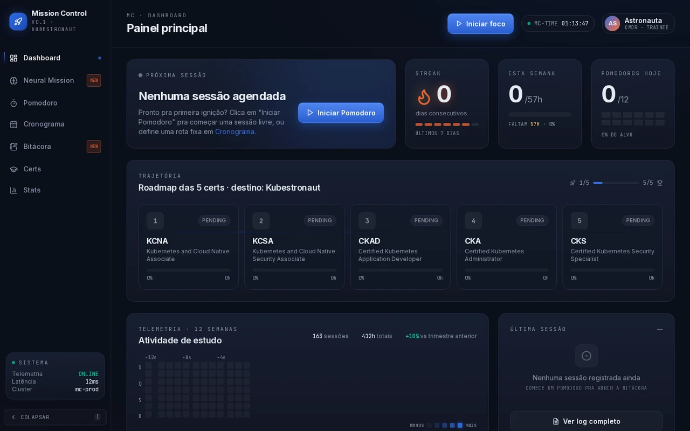
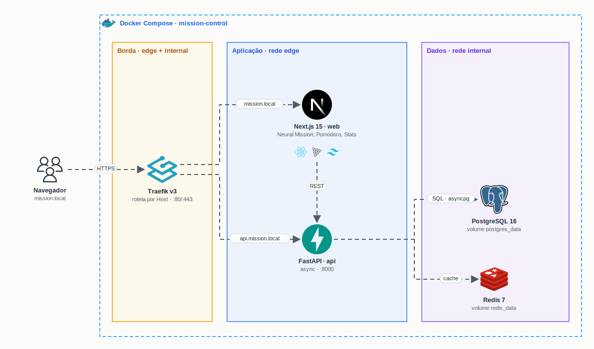

<h1 align="center">
  Kubestronaut · Mission Control
</h1>

<p align="center">
  
</p>

<p align="center">
  <a href="https://skillicons.dev">
    
  </a>
</p>

> "The Kubestronaut Program recognizes individuals who have demonstrated expertise across the entire CNCF Kubernetes certification portfolio." · CNCF

## Qual a finalidade do projeto?

Plano de estudos para conquistar as **5 certificações Kubernetes da CNCF** e se tornar **Kubestronaut** em 12 meses, com material organizado por certificação e um sistema próprio para acompanhar a jornada: o **Mission Control**.

O Mission Control é um painel com cara de centro de controle de missão espacial. Ele mostra o progresso de cada certificação, organiza o cronograma semanal, cronometra as sessões com Pomodoro e registra tudo em estatísticas. O destaque é a **Neural Mission**: uma **constelação 3D** em que cada certificação é uma estrela, com telemetria dos estudos em tempo real e um **modo Cinema** em tela cheia.

A própria aplicação usa a stack que está sendo estudada: tudo roda em containers, atrás de um reverse proxy, pronto para ir para Kubernetes.

## O que foi construído

### Roadmap das certificações

| # | Certificação | Nome | Foco |
|---|---|---|---|
| 1 | [**KCNA**](certs/kcna) | Kubernetes and Cloud Native Associate | Fundamentos cloud native |
| 2 | [**KCSA**](certs/kcsa) | Kubernetes and Cloud Native Security Associate | Fundamentos de segurança |
| 3 | [**CKAD**](certs/ckad) | Certified Kubernetes Application Developer | Desenvolvimento de aplicações |
| 4 | [**CKA**](certs/cka) | Certified Kubernetes Administrator | Administração de cluster |
| 5 | [**CKS**](certs/cks) | Certified Kubernetes Security Specialist | Segurança avançada |

```
[KCNA] ──▶ [KCSA] ──▶ [CKAD] ──▶ [CKA] ──▶ [CKS] ──▶ 🚀 KUBESTRONAUT
```

### Mission Control

| Tela | Descrição |
|---|---|
| Painel principal | Próxima sessão, streak, horas da semana, pomodoros do dia e o roadmap das 5 certificações |
| Neural Mission | Constelação 3D das certificações (Three.js) com telemetria, painéis arrastáveis e modo Cinema |
| Certificações | Progresso de cada certificação e detalhe por domínio da prova, com recursos de estudo |
| Cronograma | Semana em blocos de estudo, com edição e totais de horas planejadas |
| Pomodoro | Modos Quick, Classic, Long, Ultradian e Madrugadão (sessão noturna longa) |
| Stats | Horas por dia, distribuição por certificação e mapa de pomodoros por hora |
| Bitácora | Diário de estudo com prints, links e anotações |

### Infraestrutura

| Serviço | Descrição |
|---|---|
| `traefik` | Reverse proxy: roteia `mission.local` para o web e `api.mission.local` para a API |
| `web` | Next.js 15 + React + Three.js + Tailwind (porta 3000) |
| `api` | FastAPI assíncrona com health check de banco e cache (porta 8000) |
| `db` | PostgreSQL 16 com volume `postgres_data` |
| `redis` | Redis 7 com volume `redis_data` |

## Arquitetura

<p align="center">
  
</p>

## Tecnologias utilizadas

- **Kubernetes:** tema dos estudos e das 5 certificações;
- **Next.js 15 + React + TypeScript:** interface do Mission Control;
- **Three.js:** constelação 3D da Neural Mission;
- **Tailwind CSS:** estilo visual do painel;
- **FastAPI:** API assíncrona em Python;
- **PostgreSQL 16:** banco de dados;
- **Redis 7:** cache;
- **Traefik v3:** reverse proxy com roteamento por Host;
- **Docker Compose:** sobe a stack inteira com um comando.

## Estrutura do repositório

```text
studies-cert-kubestronaut/
├── certs/                       # Guia de cada certificação: formato da prova, domínios e recursos
│   ├── kcna/
│   ├── kcsa/
│   ├── ckad/
│   ├── cka/
│   └── cks/
├── mission-control/
│   ├── frontend/                # Next.js 15 (web)
│   ├── backend/                 # FastAPI (api)
│   ├── db/init/                 # Seed do PostgreSQL
│   ├── docker-compose.yml       # Traefik, web, api, db e redis
│   └── PLAN.md                  # Plano completo do sistema
├── docs/
│   ├── demo.webp                # Demonstração do Mission Control
│   └── arch.gif                 # Diagrama da arquitetura
├── docker-compose.yml           # Ponto de entrada: inclui o compose do Mission Control
└── README.md
```

## Fluxo de funcionamento

1. `docker compose up -d` na raiz sobe Traefik, web, api, PostgreSQL e Redis.
2. O Traefik recebe as requisições e roteia por Host para o web ou para a API.
3. O web (Next.js) monta o painel, a constelação 3D e as telas de cronograma, pomodoro e stats.
4. O web consome a API (FastAPI), que acessa o PostgreSQL via asyncpg e o Redis como cache.
5. Cada sessão de estudo registrada alimenta o progresso das certificações e as estatísticas.
6. O material de cada certificação fica em `certs/<certificação>/`, seguindo a ordem do roadmap.

## Como rodar

```bash
docker compose up -d
```

| Serviço | Acesso |
|---|---|
| Mission Control | http://localhost:3000 |
| API (docs) | http://localhost:8000/docs |
| Dashboard do Traefik | http://localhost:8080 |

```bash
docker compose ps            # containers
docker compose logs -f web   # logs do frontend
docker compose down          # para tudo
```

## Como validar a entrega

Em uma validação end-to-end, a stack deve subir com um comando e todas as telas do Mission Control devem abrir, com a constelação 3D renderizando.

Pontos principais de validação:

- `docker compose ps` com os 5 serviços ativos e `db`/`redis` saudáveis;
- `GET http://localhost:8000/health` respondendo `200`;
- painel, certificações, cronograma, pomodoro, stats e bitácora abrindo sem erro;
- Neural Mission renderizando as 5 estrelas e entrando no modo Cinema;
- detalhe de cada certificação (`/certs/KCNA` a `/certs/CKS`) com os domínios da prova.

## Autor

**William Alves Coelho** · [@willtechdev](https://github.com/willtechdev)
